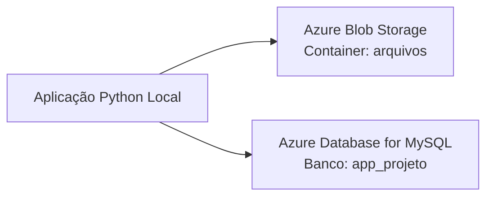

# Atividade 4.1 — Armazenamento de Dados em Nuvem: Storage + Banco de Dados + Integração

## 1. Título e Identificação

- **Aluno:** Rafael Paschoalotti  
- **RA:** (preencher)  
- **Disciplina:** Computação em Nuvem II (ISW035)  
- **Professor:** Ronan Adriel Zenatti  
- **Semestre:** 2025/1  
- **Instituição:** FATEC Jahu — Centro Paula Souza  

---

## 2. Descrição do Projeto

Este projeto foi desenvolvido em **Python** para demonstrar a integração entre uma aplicação local e serviços gerenciados da **Microsoft Azure**.

A aplicação realiza as seguintes operações:

- Upload de arquivo para o Azure Blob Storage  
- Listagem de arquivos presentes no container  
- Exclusão de arquivo do container  
- Consulta de dados em uma tabela MySQL hospedada na Azure  

O programa é executado pelo terminal e apresenta um menu interativo, permitindo testar cada funcionalidade individualmente.

---

## 3. Plataforma Escolhida

A plataforma escolhida foi a **Microsoft Azure**.

### Justificativa

A Azure foi escolhida pelos seguintes motivos:

- disponibilidade de créditos pelo programa Azure for Students  
- facilidade de criação dos recursos pelo portal e pela CLI  
- integração simples entre Blob Storage e Azure Database for MySQL  
- documentação oficial ampla e bem organizada  

---

## 4. Serviços Utilizados

### Resource Group
- **Nome:** rg-cnuvem2-t1  
- **Região:** Brazil South  

### Azure Storage Account
- **Nome:** stcnuvem2t1rafael  
- **Tipo:** StorageV2  
- **SKU / Redundância:** Standard_LRS  
- **Access Tier:** Hot  
- **Região:** Brazil South  

### Container do Blob Storage
- **Nome do container:** arquivos  
- **Tipo de acesso:** privado  

### Azure Database for MySQL — Flexible Server
- **Nome do servidor:** mysql-cnuvem2-t1-rafael  
- **Versão:** MySQL 8.0  
- **SKU:** Standard_B1ms  
- **Tier:** Burstable  
- **Armazenamento:** 20 GB  
- **Backup:** 7 dias  
- **Região:** Brazil South  

### Banco de Dados
- **Nome:** app_projeto  

---

## 5. Como os Serviços Foram Configurados

### 5.1 Criação do Resource Group

```bash
az group create \
  --name rg-cnuvem2-t1 \
  --location brazilsouth
```

### 5.2 Criação da Storage Account

```bash
az storage account create \
  --name stcnuvem2t1rafael \
  --resource-group rg-cnuvem2-t1 \
  --location brazilsouth \
  --sku Standard_LRS \
  --kind StorageV2 \
  --access-tier Hot
```

### 5.3 Criação do container

```bash
az storage container create \
  --name arquivos \
  --account-name stcnuvem2t1rafael \
  --auth-mode login
```

### 5.4 Obtenção da connection string

```bash
az storage account show-connection-string \
  --name stcnuvem2t1rafael \
  --resource-group rg-cnuvem2-t1 \
  --output tsv
```

### 5.5 Criação do servidor MySQL

```bash
az mysql flexible-server create \
  --resource-group rg-cnuvem2-t1 \
  --name mysql-cnuvem2-t1-rafael \
  --location brazilsouth \
  --admin-user youruser \
  --admin-password yourpassword \
  --sku-name Standard_B1ms \
  --tier Burstable \
  --storage-size 20 \
  --version 8.0.21 \
  --public-access 0.0.0.0
```

### 5.6 Liberação do IP no firewall

```bash
az mysql flexible-server firewall-rule create \
  --resource-group rg-cnuvem2-t1 \
  --name mysql-cnuvem2-t1-rafael \
  --rule-name MeuIP \
  --start-ip-address SEU_IP_PUBLICO \
  --end-ip-address SEU_IP_PUBLICO
```

### 5.7 Criação do banco de dados

```bash
az mysql flexible-server db create \
  --resource-group rg-cnuvem2-t1 \
  --server-name mysql-cnuvem2-t1-rafael \
  --database-name app_projeto
```

### 5.8 Criação da tabela e inserção dos dados

A tabela foi criada executando o arquivo:

```
sql/schema.sql
```

A execução foi feita utilizando o **DBeaver**, com SSL habilitado na conexão.

---

## 6. Diagrama de Arquitetura

### Diagrama em texto

```
[Aplicação Python Local]
        ├──> [Azure Blob Storage / Container: arquivos]
        └──> [Azure Database for MySQL / Banco: app_projeto]
```

### Diagrama em Mermaid



---

## 7. Pré-requisitos

Para executar o projeto, é necessário ter instalado:

- Python 3.9 ou superior  
- pip  
- Git  
- Conta na Azure  
- Acesso à internet  

### Dependências Python

- azure-storage-blob  
- mysql-connector-python  
- python-dotenv  
- tabulate  

Todas estão listadas no arquivo `requirements.txt`.

---

## 8. Como Executar

### 8.1 Clonar o repositório

```bash
git clone https://github.com/seu-usuario/cnuvem2-t1-rafael-paschoalotti.git
cd cnuvem2-t1-rafael-paschoalotti
```

### 8.2 Criar ambiente virtual

#### Windows

```bash
python -m venv venv
venv\Scripts\activate
```

#### Linux/macOS

```bash
python3 -m venv venv
source venv/bin/activate
```

### 8.3 Instalar dependências

```bash
pip install -r requirements.txt
```

### 8.4 Configurar variáveis de ambiente

#### Windows

```bash
copy .env.example .env
```

#### Linux/macOS

```bash
cp .env.example .env
```

Editar o arquivo `.env`:

```
DB_HOST=
DB_PORT=
DB_NAME=
DB_USER=
DB_PASSWORD=
AZURE_STORAGE_CONNECTION_STRING=
AZURE_CONTAINER_NAME=
```

### 8.5 Criar a tabela e inserir os dados

Executar o arquivo `sql/schema.sql` no MySQL da Azure usando o DBeaver.

### 8.6 Executar a aplicação

```bash
python src/main.py
```

### 8.7 Funcionalidades disponíveis no menu

- 1 — Upload de arquivo para o Blob Storage  
- 2 — Listar arquivos do Blob Storage  
- 3 — Excluir arquivo do Blob Storage  
- 4 — Consultar registros do MySQL  
- 0 — Sair  

---

## 9. Estrutura da Tabela MySQL

### Banco de dados
- **Nome:** app_projeto  

### Tabela
- **Nome:** produtos  

### Estrutura

| Coluna     | Tipo           | Restrições                        |
|------------|----------------|----------------------------------|
| id         | INT            | PRIMARY KEY, AUTO_INCREMENT      |
| nome       | VARCHAR(100)   | NOT NULL                         |
| descricao  | TEXT           | —                                |
| preco      | DECIMAL(10,2)  | NOT NULL                         |
| categoria  | VARCHAR(50)    | —                                |
| criado_em  | DATETIME       | DEFAULT CURRENT_TIMESTAMP        |

### Dados inseridos

| id | nome                  | descricao                         | preco   | categoria    |
|----|-----------------------|-----------------------------------|---------|--------------|
| 1  | Notebook Gamer        | Notebook 16GB RAM RTX 4060        | 5499.90 | Eletronicos  |
| 2  | Mouse Wireless        | Mouse ergonomico sem fio          | 149.90  | Perifericos  |
| 3  | Teclado Mecanico      | Teclado switch blue RGB           | 329.90  | Perifericos  |
| 4  | Monitor 27 polegadas  | Monitor IPS 144Hz                 | 1899.00 | Eletronicos  |
| 5  | Webcam Full HD        | Webcam 1080p com microfone        | 249.90  | Perifericos  |

### Local do script SQL

```
sql/schema.sql
```

---

## 10. Evidências

As evidências de funcionamento estão na pasta `evidencias/`.

### Arquivos incluídos:

- evidencias/upload-arquivo.png  
- evidencias/listagem-storage.png  
- evidencias/delete-arquivo.png  
- evidencias/consulta-mysql.png  

### Demonstrações:

- upload de arquivo funcionando corretamente  
- listagem dos arquivos no container  
- exclusão de arquivo do storage  
- consulta dos registros da tabela `produtos` no MySQL  
